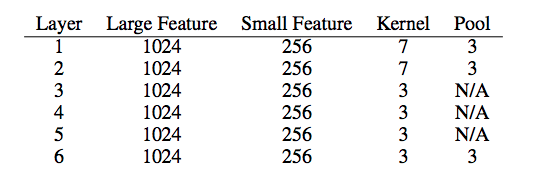
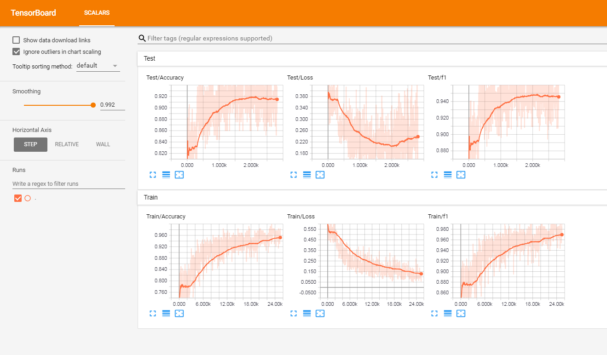

## Character Based CNN

This repo contains a PyTorch implementation of a character-level convolutional neural network for text classification.

The model architecture comes from this paper: https://arxiv.org/pdf/1509.01626.pdf

There are two variants: a large and a small. You can switch between the two by changing the configuration file.

There are basically 6 convolutional layers:

and and 2 fully connected layers:

## Why you should care about character level CNNs

- They are quite powerful in text classification (see paper's benchmark) iven though they have no notion of semantics
- You don't need to apply any text preprocessing (tokenization, lemmatization, stemming ...) while using them
- They handle misspelled words and OOV (out-of-vocabulary) tokens very well when testing
- They are faster to train compared to recurrent networks
- They are lightweight since they don't require storing a large word embedding matrix, hence you can deploy them in production more easily

## Results

I have tested this model on a set of french labeled customer reviews (of over 3 millions rows). I reported the metrics in TensorboardX. 

The results are petty amazing: the F1 score is over 0.94 on the test set.

## Dependencies

- numpy 
- pandas
- sklearn
- PyTorch 0.4.1
- tensorboardX

## Structure of the code

At the root of the project, you will have:

- **train.py**: used for training a model
- **predict.py**: used for the testing and inference
- **config.json**: a configuration file for storing model parameters (number of filters, neurons)
- **src**: a folder that contains:
  - **cnn_model.py**: the actual CNN model (model initialization and forward method)
  - **data_loader.py**: the script responsible of passing the data to the training after processing it
  - **utils.py**: a set of utility functions for text preprocessing (url/hashtag/user_mention removal)

## How to use the code

### Training

Launch train.py with the following arguments (their default values are written in train.py)

- `data_path`: path for the data. It should be csv file with a column for text and a column for the label
- `validation_split`: ratio of train data (default to 0.8), the remaining is for validation.
- `label_column`: column name of the labels
- `text_column`: column name of the text 
- `max_rows`: the maximum number of rows to load from the dataset. (I use this when testing)
- `chunksize`: size of the chunks when loading the data using pandas
- `encoding`: default to utf-8
- `steps`: 
- `alphabet`: default to abcdefghijklmnopqrstuvwxyz0123456789,;.!?:'\"/\\|_@#$%^&*~\`+-=<>()[]{} 
- `number_of_characters`
- `extra_characters`
- `config_path`
- `size`
- `max_length`
- `number_of_classes`
- `epochs`
- `batch_size`
- `optimizer`
- `learning_rate`
- `schedule`
- `patience`
- `checkpoint`
- `workers`
- `log_path`
- `output`
- `model_name`

Example:

python train.py --data_path=/data/tweets.csv --max_rows=200000 

### Testing

## License

This project is licensed under the MIT License
